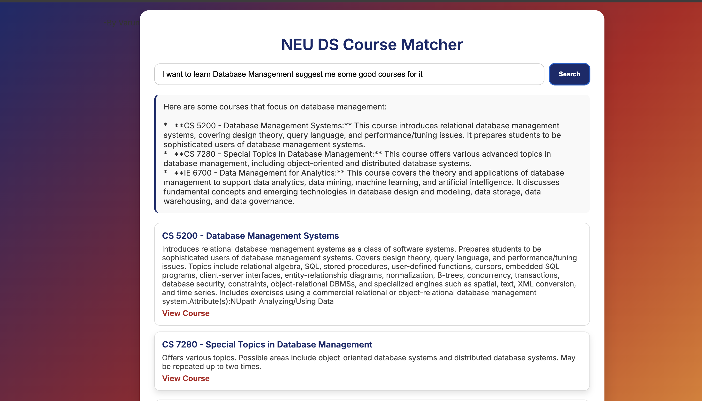

# 🎓 NEU DS Course Matcher

A Retrieval-Augmented Generation (RAG) chatbot that helps students discover **Northeastern University Data Science** graduate courses that fit their interests.

Built with **FastAPI**, **FAISS**, **SentenceTransformers**, **Gemini 2.0 Flash**, and a polished **HTML/CSS/JS** frontend.

---

## 🎥 Demo

<video src="demo.mp4" controls width="720"></video>

> Fallback download link: [demo.mp4](./demo.mp4)

---

## 📸 Screenshot



---

## ✨ Features

- 🔎 **Semantic Retrieval** with FAISS (cosine similarity on normalized embeddings)
- 🤖 **RAG Generation** using Gemini 2.0 Flash (grounded by retrieved context)
- 🧠 **Zero-Hallucination Prompting** (answers constrained to catalog context)
- ⚡ **FastAPI** endpoints: `/retrieve` and `/ask`
- 🖥️ **Clean Frontend** (`frontend.html`) with loader, cards, and helpful layout

---

## 🧱 Project Structure

```
RAG_Student/
├── scraping.py                # Scrapes catalog course links & descriptions
├── preprocessing.py           # Cleans text, builds processed_courses2.json
├── embeddingvectordb.py       # Builds FAISS index from processed data
├── query.py                   # CLI test of retrieval (top-k)
├── rag.py                     # LLM RAG (Gemini) using retrieved context
├── api.py                     # FastAPI server exposing /retrieve and /ask
├── frontend.html              # Standalone UI (no build tools needed)
├── data/
│   ├── processed_courses2.json # Cleaned metadata (title, number, desc, url)
│   └── course_index.faiss      # FAISS index (IP on normalized vectors)
├── .env                       # GEMINI_API_KEY=...
├── requirements.txt           # Python dependencies
└── README.md                  # This file
```

---

## 🛠️ Prerequisites

- Python 3.9+ (recommended)
- A Google **Gemini API key**
- macOS/Linux/Windows

---

## ⚙️ Setup

### 1) Clone & enter the project

```bash
git clone https://github.com/your-username/RAG_Student.git
cd RAG_Student
```

### 2) Create & activate a virtual environment

```bash
python3 -m venv venv
# macOS/Linux
source venv/bin/activate
# Windows (PowerShell)
venv\Scripts\Activate.ps1
```

### 3) Install dependencies

```bash
pip install -r requirements.txt
```

### 4) Add your Gemini API key

Create a `.env` file in the project root:

```ini
GEMINI_API_KEY=your_api_key_here
```

### 5) Prepare data (scrape → preprocess → index)

Run the pipeline in order (these produce files in `data/`):

```bash
python scraping.py
python preprocessing.py
python embeddingvectordb.py
```

You should now have:

- `data/processed_courses2.json`
- `data/course_index.faiss`

---

## 🚀 Run the App

### Backend (FastAPI)

```bash
uvicorn api:app --reload --port 8000
```

API base: [http://127.0.0.1:8000](http://127.0.0.1:8000)

Swagger docs: [http://127.0.0.1:8000/docs](http://127.0.0.1:8000/docs)

### Frontend (static HTML)

Open `frontend.html` directly in your browser (double-click or drag into a tab).

The page calls `http://127.0.0.1:8000/ask`. Make sure the backend is running.

---

## 🧩 API Endpoints

### `GET /health`

Health check.

**Response**
```json
{ "status": "ok" }
```

### `POST /retrieve`

Retrieve top-k relevant courses (no LLM).

**Request**
```json
{
  "question": "I want courses in machine learning",
  "top_k": 5
}
```

**Response**
```json
{
  "courses": [
    {
      "rank": 1,
      "course_number": "CS 6140",
      "title": "Machine Learning",
      "description": "Provides a broad look at ...",
      "url": "https://catalog.northeastern.edu/...",
      "score": 0.76
    }
  ]
}
```

### `POST /ask`

RAG: retrieve + generate a grounded answer.

**Request**
```json
{
  "question": "I want to learn about machine learning and AI",
  "top_k": 5,
  "temperature": 0.2
}
```

**Response**
```json
{
  "model": "gemini-2.0-flash",
  "answer": "Here are courses that cover ML and AI...",
  "courses": [ /* same shape as /retrieve */ ]
}
```
`temperature` is optional (defaults to 0.2). Lower = more deterministic.

---

## 🧪 Quick cURL Test

```bash
curl -X POST http://127.0.0.1:8000/ask \
  -H "Content-Type: application/json" \
  -d '{"question":"Which courses cover NLP?","top_k":5,"temperature":0.2}'
```

---

## 🔐 Notes on Retrieval

- Embeddings model: `sentence-transformers/all-MiniLM-L6-v2`
- We normalize embeddings and use FAISS `IndexFlatIP`
- Inner Product (IP) on normalized vectors = cosine similarity

---

## 📝 License

This project is licensed under the MIT License. See LICENSE for details.

---

## 👤 Author

Built by Saivarun Garimella Narasimha· Data Scientist

---

##